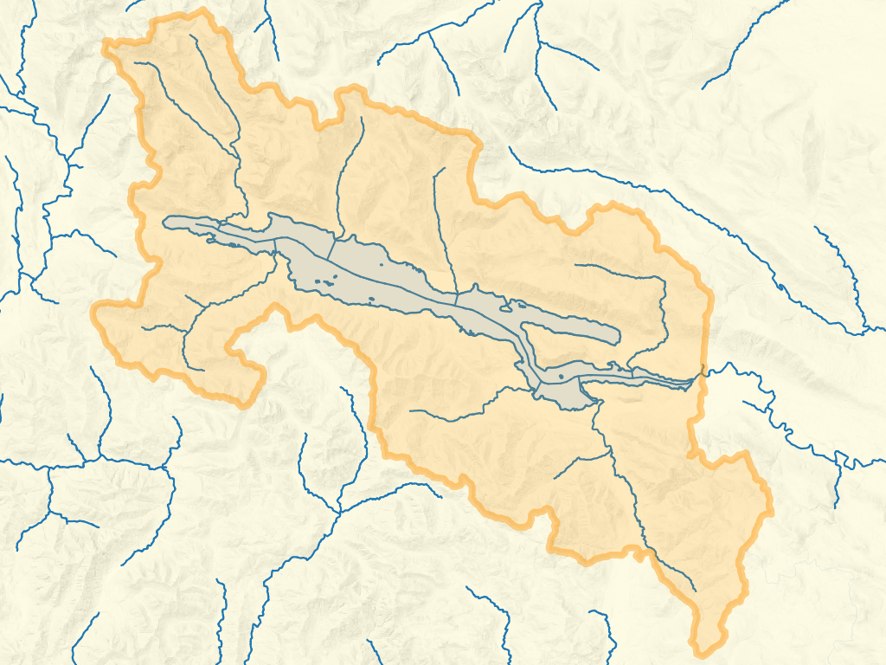

# Function reference

## FWA_Downstream

### Synopsis

```sql
FWA_Downstream(
      wscode A ltree,
      localcode A ltree,
      wscode B ltree,
      localcode B ltree
)

FWA_Downstream(
    blue_line_key A integer,
    downstream_route_measure A double precision,
    wscode_ltree A ltree,
    localcode_ltree A ltree,
    blue_line_key B integer,
    downstream_route_measure B double precision,
    wscode_ltree B ltree,
    localcode_ltree B ltree,
    include_equivalents boolean default False,
    tolerance double precision default .001
)
```

### Description

Return `True` if the watershed codes / measures B are downstream of watershed codes / measure A.

For polygonal features (where no `blue_line_key` / `downstream_route_measure` is present), use the shorter form of the function.

For point locations referenced to the stream network, use the form of the function with `blue_line_key` and `downstream_route_measure`.  Also, specify `True` for `include_equivalents` if you want to evaluate as true for features with exactly the same linear position.

### Examples

1. At its most basic, the function compares two watershed code / local code `ltree` pairs and returns `True` if the second pair is a parent of the first set (ie, downstream).

    ```sql
    SELECT FWA_Downstream(
      '100.100000.000100'::ltree,
      '100.100000.000100'::ltree,
      '100.100000'::ltree,
      '100.100000'::ltree
    )
    ```
    ```
     fwa_downstream
    ----------------
     t
    ```

2. Find features downstream of a known location on the network - this query finds the total length of stream downstream from Hope. Note that this result includes side channels, it is not necessarily the distance to the ocean:

    ```sql
    SELECT
      ROUND((SUM(st_length(s.geom)) / 1000)::numeric, 2) as length_dnstr_km
    FROM whse_basemapping.fwa_stream_networks_sp s
    WHERE FWA_Downstream(
      356364114, 160400, '100'::ltree, '100.113848'::ltree,
      s.blue_line_key, s.downstream_route_measure, s.wscode_ltree, s.localcode_ltree
    );
    ```
    ```
     length_dnstr_km
    -----------------
              308.54
    ```
    Refine this slightly to find the distance to the ocean along the Fraser mainstem (where `blue_line_key` is equal to `watershed_key`:

    ```sql
    SELECT
      ROUND((SUM(st_length(s.geom)) / 1000)::numeric, 2) as length_dnstr_km
    FROM whse_basemapping.fwa_stream_networks_sp s
    WHERE FWA_Downstream(
      356364114, 160400, '100'::ltree, '100.113848'::ltree,
      s.blue_line_key, s.downstream_route_measure, s.wscode_ltree, s.localcode_ltree
    )
    AND watershed_key = blue_line_key; -- do not include side channels
    ```
    ```
     length_dnstr_km
    -----------------
              161.40
    ```
3. For each feature in table A, find all records downstream in table B and collect them into an array. This query lists all dams downstream of each fish passage field assessment location (data from [`bcfishpass`](https://github.com/smnorris/bcfishpass))

    ```sql
    SELECT
      a.aggregated_crossings_id,
      array_agg(b.dam_id) as downstream_dam_ids
    FROM bcfishpass.crossings a
    INNER JOIN bcfishpass.dams b
    ON FWA_Downstream(
      a.blue_line_key,
      a.downstream_route_measure,
      a.wscode_ltree,
      a.localcode_ltree,
      b.blue_line_key,
      b.downstream_route_measure,
      b.wscode_ltree,
      b.localcode_ltree
    )
    WHERE a.stream_crossing_id IS NOT NULL
    GROUP BY a.aggregated_crossings_id
    ```
    ```
     aggregated_crossings_id | downstream_dam_ids
    -------------------------+-----------------------
                        4790 | {2343}
                       69233 | {917,1801,2165,2310}
                        5468 | {2472}
                      125252 | {15,97,213,1917}
                        5697 | {2472}
                         176 | {2472}
                         576 | {426}
    ```

## FWA_DownstreamTrace

### Synopsis

```sql
FWA_DownstreamTrace(
    start_blue_line_key integer,
    start_measure float,
    tolerance float default 1
)
```

### Description

Return all data from [`whse_basemapping.streams_vw`](https://smnorris.github.io/fwapg/03_tables_views.html#whse-basemapping-fwa-streams-vw) downstream of provided location.

Provides a simpler interface to the basic use case of `FWA_Downstream()`, removing the need to use joins or watershed codes.

Notes:
- this is a draft function that has not been extensively optimized/tested, performance may suffer when working with major rivers
- result will include side channels

### Example

Return stream data downstream of Sheilds Lake:

  ```sql
  SELECT
    blue_line_key,
    downstream_route_measure,
    stream_order_parent,
    channel_width,
    geom
  FROM
    FWA_DownstreamTrace(354146454, 3150)
  ```
  ```
   blue_line_key | downstream_route_measure | stream_order_parent | channel_width | geom
  ---------------+--------------------------+---------------------+---------------+------
       354146454 |         3127.20524239473 |                   3 |               |
       354146454 |         2965.37071386052 |                   3 |               |
       354146454 |         2842.60982622329 |                   3 |               |
       354146454 |         2679.16744750456 |                   3 |               |
       354146454 |         2629.74618714613 |                   3 |               |
       354146454 |         2609.65517389417 |                   3 |          2.15 |
       354146454 |         2502.91937533387 |                   3 |          2.15 |
       354146454 |         2394.95066476193 |                   3 |          2.15 |
       354146454 |         2352.13213028193 |                   3 |          2.15 |
       354146454 |         2240.02438811748 |                   3 |          2.15 |
       354146454 |         2169.25535011117 |                   3 |          2.15 |
       354146454 |         2138.31957468439 |                   3 |          2.62 |
       354146454 |         2025.39804344686 |                   3 |          2.91 |
       354146454 |         1992.73137196029 |                   3 |          2.91 |
       354146454 |          1847.8788247426 |                   3 |          2.91 |
       354146454 |         960.782490852403 |                   3 |          2.91 |
       354146454 |         660.760737217136 |                   3 |          3.17 |
       354146454 |                        0 |                   3 |          3.46 |
       354148774 |          3059.9040521127 |                   5 |          5.94 |
       354148774 |         2744.26659482523 |                   5 |          6.04 |
       354148774 |         1431.17077828375 |                   5 |          6.28 |
       354148774 |         1376.10785016488 |                   5 |           6.6 |
       354148774 |         1243.32075546327 |                   5 |           6.6 |
       354148774 |         710.353826210263 |                   5 |           6.6 |
       354148774 |         15.1842503508841 |                   5 |           8.5 |
       354148774 |                        0 |                   5 |           8.5 |
       354153927 |         4568.48427688637 |                     |         32.26 |
       ...
  ```

## FWA_IndexPoint

### Synopsis

```sql
FWA_IndexPoint(
    point geometry(Point, 3005),
    tolerance float DEFAULT 5000,
    num_features integer DEFAULT 1
)

FWA_IndexPoint(
    x float,
    y float,
    srid integer,
    tolerance float DEFAULT 5000,
    num_features integer DEFAULT 1
)
```

### Description

Snaps a point to the stream network. Provided a point (as either a BC Albers point geometry or (`x, y, srid`), return a table containing the point geometry/geometries of the closest point(s) on the FWA stream network to the given point, plus additional attributes from the matched stream(s). 

| field                     | type                  | description                                 |
| :-------------------------| --------------------- |-------------------------------------------- |
| `linear_feature_id`       | bigint                | unique identifier of matched stream         |
| `gnis_name`               | text                  | stream name of matched stream               |
| `wscode_ltree`            | ltree                 | stream watershed code                       |
| `localcode_ltree`         | ltree                 | stream local watershed code                 |
| `blue_line_key`           | integer               | stream blue line key (route identifier)     |
| `downstream_route_measure`| double precision      | measure value of output point               |
| `distance_to_stream`      | double precision      | distance from input point to output point   |
| `bc_ind`                  | boolean               | Indicates if the source point is in BC      |
| `geom`                    | geometry(Point, 3005) | The closest point on the FWA stream network |

### Options

`tolerance` - Return only stream feature(s) within this distance (metres) (default = `5000`)  
`num_features` - Number of features to be returned (default = `1`)

### Examples

1. Return the closest point on FWA stream network to a point defined by a lon/lat (within default 5000m tolerance):

    ```sql
    SELECT * FROM FWA_IndexPoint(-123.7028, 48.3858, 4326);
    ```
    ```
     linear_feature_id |  gnis_name  | wscode_ltree | localcode_ltree | blue_line_key | downstream_route_measure | distance_to_stream | bc_ind |                        geom
    -------------------+-------------+--------------+-----------------+---------------+--------------------------+--------------------+--------+----------------------------------------------------
             710513719 | Sooke River | 930.023810   | 930.023810      |     354153927 |        350.2530543284006 |             24.228 | t      | 0101000020BD0B0000D579287B42DC314198937D515C061741
    ```

2. Index a set of point geometries, finding up to 10 features within 100m:

    ```sql
    SELECT
      pts.id,
      i.*
    FROM (
      VALUES
      ('07EA004', ST_SetSRID(ST_MakePoint(1054676, 1304723), 3005)),
      ('07EA005', ST_SetSRID(ST_MakePoint(1045356, 1348750), 3005)),
      ('07EA007', ST_SetSRID(ST_MakePoint(1066334, 1356262), 3005)),
      ('07EB002', ST_SetSRID(ST_MakePoint(1126747, 1283184), 3005)),
      ('07EC002', ST_SetSRID(ST_MakePoint(1089342, 1214473), 3005))
    ) AS pts (id, geom)
    LEFT JOIN LATERAL
    (
      SELECT *
      FROM
      FWA_IndexPoint(geom, 100, 10)
    ) i on true;
    ```
    ```
       id    | linear_feature_id |   gnis_name    |       wscode_ltree       |         localcode_ltree         | blue_line_key | downstream_route_measure | distance_to_stream | bc_ind |                        geom
    ---------+-------------------+----------------+--------------------------+---------------------------------+---------------+--------------------------+--------------------+--------+----------------------------------------------------
     07EA004 |          68051401 | Ingenika River | 200.948755.992594        | 200.948755.992594.039418        |     359571145 |        6096.256539019577 |             41.319 | t      | 0101000020BD0B00007FFBC4C0C617304173BF3D23BAE83341
     07EA004 |          68051402 |                | 200.948755.992594.042767 | 200.948755.992594.042767        |     359233576 |                        0 |              46.77 | t      | 0101000020BD0B000023DBF9FEB11730413108AC1CB3E83341
     07EA005 |          49095881 | Finlay River   | 200.948755.999851        | 200.948755.999851.137838        |     359569942 |        42909.36746325051 |             47.258 | t      | 0101000020BD0B0000C3F5289C79E62F41508D976E90943441
     07EA007 |          49083226 | Akie River     | 200.948755.999851.088011 | 200.948755.999851.088011.231827 |     359571761 |        29215.40257114563 |             40.442 | t      | 0101000020BD0B000037B9E4F44B4530410DDF6ACEC1B13441
     07EB002 |         161051216 | Ospika River   | 200.948755.951156        | 200.948755.951156.201899        |     359573063 |       29005.449548147713 |             41.647 | t      | 0101000020BD0B0000D7D491C73F3131419708AD7A50943341
     07EC002 |         115033725 | Omineca River  | 200.948755.944288        | 200.948755.944288.110746        |     359571933 |        29317.40902691083 |             95.125 | t      | 0101000020BD0B000054618DD09A9F3041A0D25C29F4873241
    ```

### Web service

[FWA_IndexPoint](https://features.hillcrestgeo.ca/fwa/functions/fwa_indexpoint.html)


## FWA_LocateAlong

### Synopsis

```sql
FWA_LocateAlong(blue_line_key integer, downstream_route_measure float)
```

### Description

Return a table containing a single point geometry corresponding to the position on the FWA stream network of input `blue_line_key`, `downstream_route_measure`.

### Example

Create a point geometry at measure 25,000 on the Skeena River:
```sql
    SELECT ST_AsText(
        FWA_LocateAlong(
          (
            SELECT DISTINCT blue_line_key
            FROM whse_basemapping.fwa_stream_networks_sp
            WHERE gnis_name = 'Skeena River'
          ),
        25000
        )
    );
```
```
                         st_astext
-----------------------------------------------------------
 POINT ZM (754013.9457165595 1029911.1568720527 5.5 25000)

```

### Web service

[FWA_LocateAlong](https://features.hillcrestgeo.ca/fwa/functions/fwa_locatealong.html)


## FWA_LocateAlongInterval

### Synopsis

```sql
FWA_LocateAlongInterval(
  blue_line_key integer,
  interval_length integer DEFAULT 1000,
  start_measure integer DEFAULT 0,
  end_measure integer DEFAULT NULL
)
```

### Description

Return a table representing points along a stream between input locations at specified interval.

| field                     | type                  | description                                 |
| :-------------------------| --------------------- |-------------------------------------------- |
| `index`                   | integer               | 0 based index of returned features          |
| `downstream_route_measure`| double precision      | measure value of output point               |
| `geom`                    | geometry(Point, 3005) | Point geometry at the measure               |

### Example

Return points at a 1km interval along the Peace between Site C and Bennet dams:

```sql
  SELECT
     index as id,
     downstream_route_measure,
     ST_AsText(geom)
  FROM FWA_LocateAlongInterval(
    359572348,
    1000,
    1597489,
    1706733
    );
```
```
 id  | downstream_route_measure |                                  st_astext
-----+--------------------------+-----------------------------------------------------------------------------
   0 |                  1597489 | POINT ZM (1314468.0708699157 1256099.567354601 412.98247677532964 1597489)
   1 |                  1598489 | POINT ZM (1313779.3421101477 1256817.5566858777 413.709000000003 1598489)
   2 |                  1599489 | POINT ZM (1313217.588407995 1257612.8656611862 413.9290255060764 1599489)
   3 |                  1600489 | POINT ZM (1312633.1479665248 1258419.2668507479 414 1600489)
...
```
Mapping the returned features:


### Web service

[FWA_LocateAlongInterval](https://features.hillcrestgeo.ca/fwa/functions/fwa_locatealonginterval.html)

Make the same request as the example above, but <a href="https://features.hillcrestgeo.ca/fwa/functions/fwa_locatealonginterval/items.html?blue_line_key=359572348&start_measure=1597489&interval_length=10000&end_measure=1706733&limit=100">at 10km</a>


## FWA_NetworkTrace

### Synopsis

```sql
FWA_NetworkTrace(
  blue_line_key_a INTEGER,
  measure_a FLOAT,
  blue_line_key_b INTEGER,
  measure_b FLOAT,
  tolerance FLOAT DEFAULT 1
)
```

### Description

Return a table of all stream network features that connect the provided locations, not including side-channels.
Stream network geometries are split at the locations provided, if the stream endpoints are not located within the distance specified by the tolerance.
Fields included are as per [`whse_basemapping.fwa_streams`](https://smnorris.github.io/fwapg/03_tables_views.html#whse-basemapping-fwa-streams).

Note that the function will return data for any provided locations, even if the locations are not connected by the source stream network (ie the connection is marine).

### Example 1

Return stream segments between a point on a trib to Chipman Creek and a point on the Chemainus River upstream of its confluence with Chipman Creek:

```sql
  SELECT 
    linear_feature_id, 
    blue_line_key, 
    downstream_route_measure,
    channel_width
  FROM fwa_networktrace(354132308, 2000, 354154440, 37100);
```

```
  linear_feature_id | blue_line_key | downstream_route_measure | channel_width 
-------------------+---------------+--------------------------+---------------
         710035813 |     354132308 |         1012.21665141576 |              
         710275878 |     354132308 |                        0 |              
         710276079 |     354155015 |         3461.16658988312 |         14.05
         710035785 |     354155015 |         3303.08602877688 |         14.23
         710276267 |     354155015 |         3128.21026243096 |         14.23
...
         710035875 |     354154440 |         35217.0414128426 |         26.16
         710277390 |     354154440 |         34335.5545669658 |         12.38
         710277402 |     354154440 |         34080.2453081494 |         10.22
         710277776 |     354154440 |         32101.5933103956 |         16.35
         710277690 |     354154440 |         31792.5224498383 |          23.1

```


### Example 2

Return stream segments between a point high in the Shushwap watershed and the Fraser River at Chilliwack:

```sql
  SELECT 
    linear_feature_id, 
    blue_line_key, 
    downstream_route_measure,
    channel_width
  FROM fwa_networktrace(356135133, 200, 356364114, 96830);
```
```
  linear_feature_id | blue_line_key | downstream_route_measure | channel_width 
-------------------+---------------+--------------------------+---------------
         703007983 |     356135133 |                        0 |          3.97
         703008157 |     356317350 |         3909.84772689516 |         10.35
         703008165 |     356317350 |         3752.92413279951 |         10.38
         703008171 |     356317350 |         3574.52153685271 |         12.23
         703008202 |     356317350 |         3437.52168976849 |         12.25
...
         701348760 |     356364114 |         97872.6823525415 |       1098.79
         701348775 |     356364114 |         97748.0754848264 |       1150.12
         701348786 |     356364114 |         97691.4227605892 |       1168.85
         701348810 |     356364114 |         97382.5273775604 |       1167.24
         701348868 |     356364114 |                    96830 |       1011.92

```


### Web service


Make the same requests as the examples above:

- <a href="https://features.hillcrestgeo.ca/fwa/functions/fwa_networktrace/items.html?blue_line_key_a=354132308&measure_a=2000&blue_line_key_b=354154440&measure_b=37100">Chipman Creek - Chemainus River</a>
- <a href="https://features.hillcrestgeo.ca/fwa/functions/fwa_networktrace/items.html?blue_line_key_a=356135133&measure_a=200&blue_line_key_b=356364114&measure_b=96830">Upper Shushwap - Fraser @ Chillwack</a>


#### Marine examples

Paths returned are the most direct route a fish or paddler could take between two locations, exluding portions of the path that are marine or not in BC:

- between <a href="https://features.hillcrestgeo.ca/fwa/functions/postgisftw.fwa_networktrace/items.html?blue_line_key_a=354142279&measure_a=1000&blue_line_key_b=354106004&measure_b=200">opposite sides of Finlayson Arm</a>

- between <a href="https://features.hillcrestgeo.ca/fwa/functions/postgisftw.fwa_networktrace/items.html?blue_line_key_a=356364114&measure_a=96830&blue_line_key_b=356570348&measure_b=41162">Chilliwack and Nelson</a>


## FWA_NetworkTraceAgg

### Synopsis

```sql
FWA_NetworkTraceAgg(
  blue_line_key_a INTEGER,
  measure_a FLOAT,
  blue_line_key_b INTEGER,
  measure_b FLOAT,
  tolerance FLOAT DEFAULT 1
)
```

### Description

Return a table of paths (aggregated stream network linestrings) connecting the provided locations, not including side-channels.
Stream network geometries are split at the locations provided, if the stream endpoints are not located within the distance specified by the tolerance.
The function will return one path if the provided locations are flow connected (upstream/downstream), two paths if they are not.

| field                     | type                  | description                                 |
| :-------------------------| --------------------- |-------------------------------------------- |
| `id`                      | integer               | 1 based index of returned features          |
| `from_blue_line_key`      | integer               | blue_line_key of starting point / point a   |
| `from_measure`            | double precision      | measure value at starting point / point a   |
| `to_blue_line_key`        | integer               | blue_line_key of ending point / point b     |
| `to_measure`              | double precision      | measure value at ending point / point b     |
| `geom`                    | geometry(LinestringZ, 3005) | geometry of the path                  |


### Example 1

Return the path between a point on a trib to Chipman Creek and a point on the Chemainus River upstream of its confluence with Chipman Creek:

```sql
  SELECT 
    id,
    from_blue_line_key,
    from_measure,
    to_blue_line_key,
    to_measure,
    ST_AsText(geom) as geom
  FROM fwa_networktraceagg(354132308, 2000, 354154440, 37100);
```

```
 id | from_blue_line_key | from_measure | to_blue_line_key |    to_measure    | geom 
----+--------------------+--------------+------------------+------------------+-----
  1 |          354132308 |         2000 |        354155015 |                0 | LINESTRING Z (...
  2 |          354154440 |        37100 |        354154440 | 31792.5224498383 | LINESTRING Z (...

```


### Example 2

Return the path between a point high in the Shushwap watershed and the Fraser River at Chilliwack:

```sql
  SELECT 
    id,
    from_blue_line_key,
    from_measure,
    to_blue_line_key,
    to_measure,
    ST_AsText(geom) as geom
  FROM fwa_networktraceagg(356135133, 200, 356364114, 96830);
```
```
  id | from_blue_line_key | from_measure | to_blue_line_key | to_measure | geom
 ----+--------------------+--------------+------------------+------------+-----                                                                                                                 
  1  |          356135133 |          200 |        356364114 |      96830 | LINESTRING Z 
```

### Web service

[FWA_NetworkTraceAgg](https://features.hillcrestgeo.ca/fwa/functions/fwa_networktraceagg.html)

Make the same requests as the examples above:

- <a href="https://features.hillcrestgeo.ca/fwa/functions/fwa_networktraceagg/items.html?blue_line_key_a=354132308&measure_a=2000&blue_line_key_b=354154440&measure_b=37100">Chipman Creek - Chemainus River</a>
- <a href="https://features.hillcrestgeo.ca/fwa/functions/fwa_networktraceagg/items.html?blue_line_key_a=356135133&measure_a=200&blue_line_key_b=356364114&measure_b=96830">Upper Shushwap - Fraser @ Chillwack</a>


#### Marine examples

As with `FWA_NetworkTrace()`, paths returned are the most direct route a fish or paddler could take between two locations, exluding portions of the path that are marine or not in BC:

- between <a href="https://features.hillcrestgeo.ca/fwa/functions/postgisftw.fwa_networktraceagg/items.html?blue_line_key_a=354142279&measure_a=1000&blue_line_key_b=354106004&measure_b=200">opposite sides of Finlayson Arm</a>

- between <a href="https://features.hillcrestgeo.ca/fwa/functions/postgisftw.fwa_networktraceagg/items.html?blue_line_key_a=356364114&measure_a=96830&blue_line_key_b=356570348&measure_b=41162">Chilliwack and Nelson</a>


## FWA_SegmentAlongInterval

### Synopsis

```sql
FWA_SegmentAlongInterval(
  blue_line_key integer,
  interval_length integer DEFAULT 100,
  start_measure integer DEFAULT 0,
  end_measure integer DEFAULT NULL
)
```

### Description

Return a table representing segments of given equal interval along a stream, between input locations.
Note that final stream segment is the remainder of the stream under the given interval.

| field                     | type                  | description                                 |
| :-------------------------| --------------------- |-------------------------------------------- |
| `index`                   | integer               | 0 based index of returned features          |
| `downstream_route_measure`| double precision      | measure value of start point of segment     |
| `upstream_route_measure`  | double precision      | measure value of end point of segment       |
| `geom`                    | geometry(MultiLineString, 3005) | Geometry of stream between the given measures |

### Example

Return stream segments at a 100m interval along the entire Goldstream river:

```sql
  SELECT
     index as id,
     downstream_route_measure,
     upstream_route_measure, 
     ST_AsText(geom)
  FROM FWA_SegmentAlongInterval(
    354152425, 
    100
    );
```
```
  id  | downstream_route_measure | upstream_route_measure | st_astext            
-----+--------------------------+------------------------+-------------------
   0 |                      100 |                    200 | MULTILINESTRING Z ((
   1 |                      200 |                    300 | MULTILINESTRING Z ((
   2 |                      300 |                    400 | MULTILINESTRING Z ((
 
...
```

## FWA_SlopeAlongInterval

### Synopsis

```sql
FWA_SlopeAlongInterval(
  blue_line_key integer,
  interval_length integer DEFAULT 100,
  distance_upstream integer DEFAULT 100,
  start_measure integer DEFAULT 0,
  end_measure integer DEFAULT NULL
)
```

### Description

Return a table representing measures, elevations and slope at equal interval along a stream, between start/end measures.

| field                     | type                  | description                                 |
| :-------------------------| --------------------- |-------------------------------------------- |
| `idx`                     | integer               | 0 based index of returned features          |
| `downstream_route_measure`| numeric               | measure value of start point of slope measurement     |
| `downstream_z`            | numeric               | elevation value at start point of slope measurement   |
| `upstream_route_measure`  | numeric               | measure value of end point of slope measurement     |
| `upstream_z`              | numeric               | elevation value at end point of slope measurement   |
| `gradient`                | numeric               | slope of stream between downstream and upstream locations |


### Example

Return upstream 100m slopes at 100m intervals along the Bonaparte River, from 1000m to 2000m.

```sql
  SELECT
     idx + 1 as id,
     downstream_measure,
     downstream_z,
     upstream_measure,
     upstream_z,
     gradient
  FROM FWA_SlopeAlongInterval(
    356363594,
    100,
    100,
    1000,
    2000
    );
```
```
 id | downstream_measure | downstream_z | upstream_measure | upstream_z | gradient
----+--------------------+--------------+------------------+------------+----------
  1 |               1000 |       308.11 |             1100 |     309.00 |    0.009
  2 |               1100 |       309.00 |             1200 |     309.47 |    0.005
  3 |               1200 |       309.47 |             1300 |     310.00 |    0.005
  4 |               1300 |       310.00 |             1400 |     310.82 |    0.008
  5 |               1400 |       310.82 |             1500 |     313.82 |    0.030
  6 |               1500 |       313.82 |             1600 |     315.62 |    0.018
  7 |               1600 |       315.62 |             1700 |     317.26 |    0.016
  8 |               1700 |       317.26 |             1800 |     318.78 |    0.015
  9 |               1800 |       318.78 |             1900 |     320.32 |    0.015
 10 |               1900 |       320.32 |             2000 |     322.39 |    0.021
```

### Web service

[FWA_SlopeAlongInterval](https://features.hillcrestgeo.ca/fwa/functions/postgisftw.fwa_slopealonginterval.html)

Make the same request as the [example above](https://features.hillcrestgeo.ca/fwa/functions/postgisftw.fwa_slopealonginterval/items.json?blue_line_key=356363594&interval_length=100&distance_upstream=100&start_measure=1000&end_measure=2000)


## FWA_StreamsAsMVT

### Synopsis

```sql
FWA_StreamsAsMVT(
  z integer,
  x integer,
  y integer
)
```

### Description

Return FWA streams as MVT, filtering by `stream_order_max` (the maximum order of a given stream / `blue_line_key`) based on the provided zoom level. 
Enables fast display of source 1:20,000 streams at all zoom levels (show full length of higher order streams at lower zooms), using `pg_tileserv`.

Note: for databases with modest resources, tiles at low zoom levels may be slow to render. The function should still be speedy enough for general use if [pg_tileserv is behind a cache](https://github.com/CrunchyData/pg_tileserv#basic-operation).

### Web service

[FWA_StreamsAsMVT](https://tiles.hillcrestgeo.ca/bcfishpass/postgisftw.fwa_streamsasmvt.html)


## FWA_Upstream

### Synopsis

```sql
-- compare watershed codes only
FWA_Upstream(
    wscode_ltree_a ltree,
    localcode_ltree_a ltree,
    wscode_ltree_b ltree,
    localcode_ltree_b ltree
)

-- compare watershed codes and route positions (lines)
FWA_Upstream(
    blue_line_key_a integer,
    downstream_route_measure_a double precision,
    upstream_route_measure_a double precision,
    wscode_ltree_a ltree,
    localcode_ltree_a ltree,
    blue_line_key_b integer,
    downstream_route_measure_b double precision,
    wscode_ltree_b ltree,
    localcode_ltree_b ltree,
    include_equivalents boolean default False,
    tolerance double precision default .001
)

-- compare watershed codes and route positions (points)
FWA_Upstream(
    blue_line_key_a integer,
    downstream_route_measure_a double precision,
    wscode_ltree_a ltree,
    localcode_ltree_a ltree,
    blue_line_key_b integer,
    downstream_route_measure_b double precision,
    wscode_ltree_b ltree,
    localcode_ltree_b ltree,
    include_equivalents boolean default False,
    tolerance double precision default .001
)
```

### Description

Return `True` if the watershed codes / measures B are upstream of watershed codes / measure A.

For polygonal features (where no `blue_line_key` / `downstream_route_measure` is present), use the shorter form of the function.

For line features, use the form of the function with `blue_line_key`, `downstream_route_measure` and `upstream_route_measure`

For point features, use the form of the function with `blue_line_key` and `downstream_route_measure`, but not `upstream_route_measure`

Specify `True` for `include_equivalents` if you want to evaluate as true for features with exactly the same linear position.


### Examples

1. At its most basic, the function compares two watershed code / local code `ltree` pairs and returns `True` if the second pair is upstream of the first pair.

    ```sql
    SELECT FWA_Upstream(
      '100.100000'::ltree,
      '100.100000'::ltree,
      '100.100000.000100'::ltree,
      '100.100000.000100'::ltree
    );
    ```
    ```
     fwa_upstream
    --------------
     t
    ```

2. Find features upstream of a known location on the network. This query finds the number of lakes upstream of the Mission/Terzaghi Dam on the Bridge River. As source FWA lakes do not have a `local_watershed_code` value, we use the `fwapg` lookup.

    ```sql
    SELECT
      count(*) AS n_lakes
    FROM whse_basemapping.fwa_lakes_poly l
    INNER JOIN whse_basemapping.fwa_waterbodies wb
    ON l.waterbody_key = wb.waterbody_key
    WHERE FWA_Upstream('100.239855','100.239855.240724', wb.wscode_ltree, wb.localcode_ltree);
    ```
    ```
     n_lakes
    ---------
         998
    (1 row)
    ```

3. For each feature in table A, find all records upstream in table B and collect them into an array. This query lists all dams upstream of each fish passage field assessment location (data from [`bcfishpass`](https://github.com/smnorris/bcfishpass))

    ```sql
    SELECT
      a.aggregated_crossings_id,
      array_agg(b.dam_id) as upstream_dam_ids
    FROM bcfishpass.crossings a
    INNER JOIN bcfishpass.dams b
    ON FWA_Upstream(
      a.blue_line_key,
      a.downstream_route_measure,
      a.wscode_ltree,
      a.localcode_ltree,
      b.blue_line_key,
      b.downstream_route_measure,
      b.wscode_ltree,
      b.localcode_ltree
    )
    WHERE a.stream_crossing_id IS NOT NULL
    GROUP BY a.aggregated_crossings_id
    ```
    ```
     aggregated_crossings_id | upstream_dam_ids
    -------------------------+-----------------------
                       69195 | {163}
                      196198 | {1427,2362}
                      195590 | {1914}
                       51959 | {2371}
                      103090 | {1085,1693,1483}
                      103088 | {1693}
                        7520 | {416,1129,708,1937,1128}
    ```

## FWA_UpstreamTrace

### Synopsis

```sql
FWA_UpstreamTrace(
  start_blue_line_key integer,
  start_measure float,
  tolerance float default 1
)
```

### Description

Return all records from `whse_basemapping.fwa_stream_networks_sp` that are upstream of provided location.
Where the provided location is more than the provided tolerance (metres) from the endpoint of the stream segment
on which it lies, split the source stream segment and only include the portion upstream of the location in the returned records.


### Example

A common use case would be to use this in combination with `FWA_IndexPoint`, extracting streams upstream of coordinates of a feature like a bridge:

```sql
-- find blkey/measure of bridge over sooke river
SELECT blue_line_key, downstream_route_measure 
FROM postgisftw.FWA_IndexPoint(-123.7028, 48.3858, 4326);
```
```
 blue_line_key | downstream_route_measure 
---------------+--------------------------
 354153927     |        350.3003598130115
 ```

```sql
-- extract streams
select * from FWA_UpstreamTrace(354153927, 350);
```

### Web service

[FWA_UpstreamTrace](https://features.hillcrestgeo.ca/fwa/functions/fwa_upstreamtrace.html)

(FWA_WatershedAtMeasure)=
## FWA_WatershedAtMeasure

### Synopsis

```sql
FWA_WatershedAtMeasure(
    blue_line_key integer,
    downstream_route_measure float
)
```

### Description

Given a point defined by its position on the FWA stream network (`blue_line_key`,`downstream_route_measure`), return a table containing a polygon geometry that defines the point's upstream watershed.

Watershed delineation following this set of rules, in order of descending priority:

1. If the point is within a lake, return everything upstream of the lake's *outflow*
2. If the point is within a polygonal river/canal the fundamental watersheds are
cut across the banks of the river/canal before being included in the aggregation
3. If the point is < 100m downstream from the top of the fundamental
watershed in which it falls, then that fundamental watershed is not included in the aggregation
4. If the point is < 50 m upstream from the bottom of the fundamental
watershed in which it falls, then that watershed is included in the aggregation

For trans-boundary watersheds, the results include non-BC areas (not present in the FWA) thanks to data [provided by DFO](https://github.com/smnorris/fwapg/tree/main/extras/xborder).

The table returned includes these columns:

| field                     | type                      | description                                 |
| :-------------------------| --------------------------|-------------------------------------------- |
| `wscode_ltree`            | `ltree`                   | watershed code of the source point          |
| `localcode_ltree`         | `ltree`                   | local watershed code of the source point    |
| `area_ha`                 | `numeric`                 | area of output geometry, hectares           |
| `refine_method`           | `text`                    | how the watershed was processed / what further processing may be required |
| `geom`                    | `geometry(Polygon, 3005)` | a polygon representing the watershed contributing to the input location |

The `refine_method` field in the output table has several possible values:

| value                     | description                                 |
| :-------------------------|-------------------------------------------- |
| `CUT`                     | Input point falls in a river/canal, output geometry is cut across the banks of the river/canal
| `DEM`                     | Input point falls on a linear stream >50m upstream from outlet of input watershed and >100m downstream from top of watershed, further processing of the fundamental watershed in which the point lies with the DEM would be valuable to improve the output watershed. This is functionally equivalent to the `DROP` value, the fundamental watershed in which the point lies is not included in the output geometry
| `DROP`                    | Input point falls on a linear stream and is <=100m downstream from the top of the fundamental watershed in which it lies - this fundamental watershed is not included in output geometry
| `KEEP`                    | Input point falls on a linear stream and is <=50m upstream from the outlet of the fundamental watershed in which it lies - this fundamental watershed is entirely retained in the output geometry
| `LAKE`                    | Input point falls within a lake/reservoir - watershed returned includes everything upstream of the outlet of the lake/reservoir


### Examples

1. Extract the geometry of the watershed upstream of the Cowichan River at Hwy 19:

    ```sql
    SELECT geom FROM FWA_WatershedAtMeasure(354155148, 49129.75);
    ```

    

2. Extract the watershed upstream of Chilliwack Lake:

    ```sql
    WITH indexed_pt AS
    (
      SELECT
        i.*
      FROM
      (
        -- find a point in the lake
        SELECT st_pointonsurface(geom) AS geom
        FROM whse_basemapping.fwa_lakes_poly
        WHERE gnis_name_1 = 'Chilliwack Lake'
      ) AS pt
      LEFT JOIN LATERAL
      (
        SELECT *
        FROM
        FWA_IndexPoint(geom, 100) -- index the point in the lake to the nearest FWA stream
      ) i on true
    )

    SELECT *
    FROM FWA_WatershedAtMeasure(
      (SELECT blue_line_key from indexed_pt),
      (SELECT downstream_route_measure from indexed_pt)
    );
    ```

    ```
       wscode_ltree    |     localcode_ltree      | area_ha  | refine_method  | geom
    -------------------+--------------------------+----------+----------------+-----
     100.064535.057628 | 100.064535.057628.634957 | 33478.28 | LAKE           |
    ```

    Mapped, the geometry looks like this - the USA portion of the watershed is included:

    

### Web service

[FWA_WatershedAtMeasure](https://features.hillcrestgeo.ca/fwa/functions/fwa_watershedatmeasure.html)